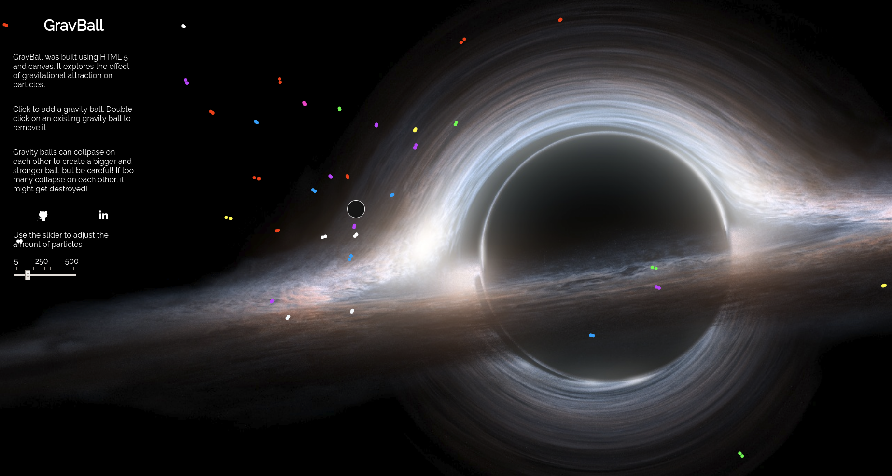
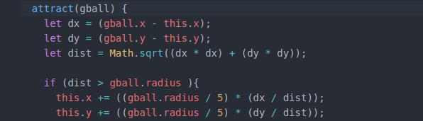
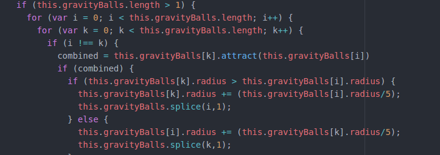
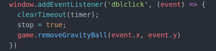
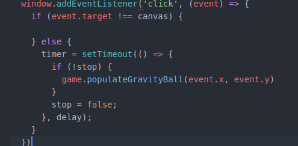

# GravBall
[Live Site](https://ralej86.github.io/GravBall/)

## Description
GravBall is an interactive animation that demonstrates the effects of gravitational attraction on floating particles.  

## Project Design
GravBall was designed over a 5 day period in June, 2018.  Prior to being created a list of minimum viable products (MVPs) was formed to demonstrate a planning process before development began.  These MVPs were monitored to ensure I was staying on track to meet the final deadline.

## Key Features
### Gravitational attraction of every single gravity ball on free floating particles

* Particles move towards a gravity ball based each object's position, the total distance between them, and the size of the gravity ball.
* Used Pythagorean theorem to determine distance

### Gravity balls can collapse on each other

* N squared iteration of the gravityBalls array to create the attraction between each gravity ball.
* To combine them into one larger ball, simply remove from array depending on each gravity ball's size, and increase radius of the victor
* variation of collision detection used to check whether gravity balls will collapse on each other

### Single click versus double click functionality

* double click invokes `removeGravityBall()` to remove a gravity ball on cursor position

* Single click was more problematic in terms of keeping it bug free.  
* Specified the event target such that using the slider would not produce an additional unwanted gravity ball
* Required the use of the `setTimeout` function to check whether there was a second click.

## Technologies
* JavaScript
* HTML 5 Canvas
* Webpack

Sources: [JavaScript](https://www.javascript.com/), [Canvas](https://developer.mozilla.org/en-US/docs/Web/API/Canvas_API),  [WebPack](https://webpack.js.org/)

## Future Plans
* Vectors
  * Implement a vector class to exert better control over particle attraction
* More GUI content
  * Interactive sliders for particle start size
  * Additional color sets
* Additional styling
  * Adjust colors
  * Particle and gravity ball shape/coloring
